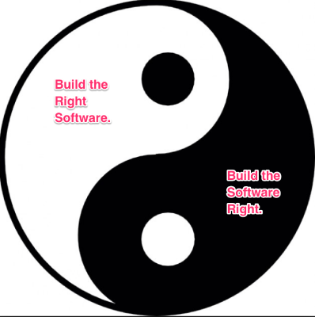

# AngularJS UGAT 

## "Ultimate Guidebook for Automated Testing"

A guide for leveraging acceptance, unit, and ui/e2e tests to build valuable software and increase developer accuracy, speed, confidence, and serenity. 
 
### For AngularJS 1.X Projects.

Looking for <a href="https://github.com/JimTheMan/Angular-UGAT">Angular-UGAT</a>, <a href="https://github.com/JimTheMan/Java-UGAT/">Java-UGAT</a>, or <a href="https://github.com/JimTheMan/React-UGAT/">React-UGAT</a>?

Table of Contents
 - [Part 1: Intro to UGAT](#Intro to UGAT)
  - [History of UGAT](#history)
  - [Purpose of UGAT](#Purpose of UGAT)
  - [Contributing to UGAT](#Contributing to UGAT)
  - [It's Not Specific To AngularJS](#It's Not Specific To Angular)
  - [This is a Guide](#This is a Guide)
  - [Is This Yet Another Interpretation of "Agile"?](#Is This Yet Another Interpretation of Agile?)
  - [Believe That Perfect Code Over Time Is Attainable](#Believe That Perfect Code Over Time Is Attainable)
  - [Can Testing Show An Absence of Defects?](#Can Testing Show An Absence of Defects)
  - [It Takes Discipline; a Lot of It](#It Takes Discipline; a Lot of It)
  - [How Am I So Excited About Testing?](#How Am I So Excited About Testing?)
 - [Part 2: The Two Core Types of Automated Tests in AngularJS](#The Two Core Types of Automated Tests)
  - [The Duality of Perfect Code](#The Duality of Perfect Code)
  - [UI Tests](#UI Tests)
  - [Running UI Tests](#Running UI Tests)
  - [The UI Tests Report](#The UI Tests Report)
  - [Unit Tests](#Unit Tests)
  - [Running Unit Tests](#Running Unit Tests)
  - [The Code Coverage Report](#The Code Coverage Report)
 - [Part 3: Acceptance Tests](#Acceptance Tests) 
  - [What Are Acceptance Tests](#What Are Acceptance Tests)
  - [Cucumberizing Your Tests](#Cucumberizing Your Tests)
  - [BDD Without Cucumber](#BDD Without Cucumber)
  - [A Gherkin Example](#A Gherkin Example)
  - [A Step Definition Example](#A Step Definition Example)
  - [Acceptance Test Reports](#Acceptance Test Reports)
 - [Part 4: UGAT in Practice](#UGAT in Practice)
  - [Don't Write Tests, Write Executable Specifications](#Don't Write Tests, Write Executable Specifications)
  - [The Gherkin Comes First](#The Gherkin Comes First)
  - [Executing The Gherkin Scripts](#Executing The Gherkin Scripts)
  - [Executing the Acceptance Tests](#Executing the Acceptance Tests)
  - [Implementing Step Definitions as Web Tests](#Implementing Step Definitions as Web Tests)
  - [Implementing Step Definitions as Unit Tests](#Implementing Step Definitions as Unit Tests)
  - [Avoiding the UI in Step Definitions](#Avoiding the UI in Step Definitions)
  - [Implementing E2e Tests in a Separate Protractor Config file](#Implementing E2e Tests in a Separate Protractor Conf.js file)
  - [Where Do I Put My Files?](#Where Do I Put My Files)
  - [Write Unit Tests and Code TDD Style](#Write Unit Tests and Code TDD Style)
  - [All the Browsers in All the Land](#All the Browsers in All the Land)
  - [Notes on Deployment](#Deployment)
  - [Testing On Multiple Browsers](#Testing On Multiple Browsers)
  - [Everyone Reads the Gherkin, Dev's Change the Gherkin](#Everyone Reads, Devs Change)
  - [No Manual Testers](#No Manual Testers)
  - [The BAU Handoff](#The BAU Handoff)
  - [Working Effectively with Non-Cucumberized Tests](#Working Effectively with Non-Cucumberized Tests)
  - [Deliverables & Artifacts](#Deliverables & Artifacts)
  - [Automating Testing as Recognizing and Applying Patterns](#Automating Testing as Recognizing and Applying Patterns)
 - [Part 5: Additional Benefits of UGAT](#Additional Benefits of UGAT)
  - [Better Team Communication and Ubiquitous Language](#Better Team Communication and Ubiquitous Language)
  - [The Requirements and Code Are Always In Sync](#The Requirements and Code Are Always In Sync)
  - [Remove the Manual Testing Bottleneck](#Remove the Manual Testing Bottleneck)
  - [JIT Documentation for Development and Beyond](#JIT Documentation for Development and Beyond)
  - [Misunderstandings Are Thrashed Out Early](#Misunderstandings Are Thrashed Out Early)
 - [Part 6: UGAT Reports](#Reporting)
  - [Why Reports Are Extremely Important](#Why Reports Are Extremely Important)
  - [Keeping the Reports Fresh](#Keeping the Reports Fresh)
  - [Generating Reports From the Codebase](#Generating Reports From the Codebase)
  - [Meetings with "The Boss"](#Meetings with The Boss)
  - [Sample Reports](#Sample Reports)
 - [Part 7: Official UGAT Projects](#Official UGAT Projects)
  - [NG-NJ](#NG-NJ)
 - [Part 8: Closing Thoughts](#Closing Thoughts)
  - [Other Types of Testing](#Other Types of Testing)
  - [Laid Back Perfectionism](#Laid Back Perfectionism)
  - [Why "Test Your Own Code" Is a Terrible Policy](#Why Test Your Own Code Is a Terrible Policy)
  - [Triplex Testing and the V-Model](#Triplex Testing and the V-Model)
  - [Effective Collaboration and Mob Programming](#Effective Collaboration and Mob Programming)
  - [Exploratory Testing](#Exploratory Testing)
  - [Triplex Testing Community Groups](#Triplex Testing Community Groups)
  - [The Jasmine Vs. Chai Debate](#The Jasmine Vs. Chai Debate)
  - [Crafting a Nice README](#Crafting a Nice README)
  - [The Importance of Having Conversations](#The Importance of Having Conversations)
  - [How Could It Not Be Perfect?](#How Could It Not Be Perfect?)
  - [Triplex Tester Certification](#Triplex Tester Certification)
 - [Part 9: Frequently Asked Questions](#FAQ)
  - [Q1. Is it wrong to treat low level step definitions like unit tests?](#Q1)
  - [Q2. Do I *need* to use acceptance tests?](#Q2)
  - [Q3. Do I *need* to use unit tests?](#Q3)
  - [Q4. Do I *need* to use e2e tests?](#Q4)
  - [Q5. When should I *NOT* use the Testing Triplex?](#Q5)
  - [Q6. Most Cucumber / BDD examples have a root level "features" folder. Why don't you follow this convention?](#Q6)
  - [Q7. My boss says we don't have enough time for testing. What should I do?](#Q7)
  - [Q8. Q8. Can't we just manually test everything?](#Q8)
  - [Q9. Will the theory of Triplex Testing work for [insert favorite platform here]?](#Q9)
  - [Q10. Why can't we use regular Cucumber.js?](#Q10)
 - [Part 10: Works Cited](#Works Cited)
 - [Part 11: Credits](#Credits)


<div name="Intro to UGAT"></div>
## Part 1: Intro to UGAT
---
<div name="history"></div>
### History of UGAT

UGAT (pronouced *ooh* like *"foo"* and *gat* like *"cat"*) is an acronym that stands for "Ultimate Guide (or Guidebook) for Automated Testing). I'm Jim Lynch, a web developer from New Jersey and organizsr of NG-NJ. While working on angularJS projects I was doing standard unit testing along with ui/web tests with Protractor. After really learning about BDD (Behavior Driven Development) I fell in love with the idea of putting your requirements into automated, execeutable tests. However, it was unclear how exactly to set up and practice BDD with an Angular, other SPA frameworks, or general JavaScript projects in a way that gelled nicely with the other automated tests. I've studying these different types of testing and tried them myself on real projects, an found what worked and didn't work for my team. I think I've discovered a great methodology for developing applications, and in this guide I'll show you concrete examples of how to apply it. This document attempts to distill this philosphy supporting and strengthening your codebase with automated tests and show you *how* to do it, specifically in the context of an AngularJS project.

<div name="Purpose of UGAT"></div>
### Purpose of UGAT

UGAT builds on the test-first theories of TDD (Test-Driven Development) and extends it by applying principles of BDD (Behavior-Driven Development). Thus, the testing triplex becomes a tao, or way of developing software where the result is truly transparent, agile, and just works. This guide provides a set of instructions for developing with The UGAT mindset, but it is up to you to find the tao on your own. You may or may not use the exact same tools as shown here, but hopefully you can take a way of thinking that will lead to successful testing implentations again and again.

<div name="Contributing to UGAT"></div>
### Contributing to UGAT

This software development philosophy is really only known about in a few small circles around New Jersey (that I know of, at least). We're always open to hearing feedback from others so don't be afraid to open an issue here, even if it's just a random question. If you feel something is missing from the Guidebook start a discussion by opening an issue, and if you want to write a section that's awesome too!


<div name="It's Not Specific To Angular"></div>
### It's Not Specific To Angular
It should be noted that the UGAT is not something that is dependant on the Angular library. It can be applied to really any project made from html, css, and javascript which can be tested with similar web/ui testing looks like Protractor (for other platforms Selenium does the same job and for mobile apps Appium is a good choice). Likewise, virtually every programming language has it's own unit testing framework (for JavaScript Jasmine or Chai-Mocha). An acceptance testing framework may be harder to find in obscure programming languages, but there's Cucumber for Rbuy, JavaScript, C++, Java, Python, Specflow for .NET, and support for many other languages. Searching "Cucumber for [X language]" will usually lead you to the choices for that particukar programming language. It's a little tricky because *"the best"* way is to have a *cucumberized* test runner for each seperately. A BDD version of unit tests and and BDD version of protractor tests. Although it's ideal, this may not always be available for yout platform or enviroment, but that's ok. Even if you can't "cucumberize" either set of tests, as  long as you have them you can use the BDD "given-when-then" steps when coding your tests and discussing examples of how the system is used.   


<div name="This is a Guide"></div>
### This is a Guide

This document is meant to be a guide for implementing automated testing in real life. Rather than be taken as gospel, the ideas expressed here are meant to convince you of the benefits of implementing these three types of automated testing. The prescribes methodoligies here have been tried a tested, but you are free to change things in your own case if you find it necessary to do so. This is a guide and may change over time and technologies change or others contrivute new ideas to it. 


 <div name="Is This Yet Another Interpretation of Agile?"></div>
### Is This Yet Another Interpretation of "Agile"?

This question here is whether the ideas in UGAT are really just another interpretation of "Agile methodologies", BDD, and TDD. In some ways, yes. UGAT values many of the core agile principles, but I like to think that UGAT is a bit more descriptive about *how* you acutally go about working this way from a programming point of view. In fact, Triplex Testing is so focused on the technical aspects that I would recommend any team attempting to try this to also look into [Design Driven Devlopment](#http://www.designdrivendevelopment.org/) and [Agile Project Management](#https://www.mountaingoatsoftware.com/agile/agile-project-management) for a high-level overview and what these methodologies are all about. It seems that everyone has their own personal version of what agile means to them. I consider UGAT to be a methodology that overlaps with Agile in that it values things like extreme programming, automated testing, continuous integration / deployment, plenty of communication among stakeholders, pair / mob programming, adaptive and interative cycles, and heavy customer / user involvement. It also goes back to the first and most important first principle of the Agile Manifesto Twelve Principles.  It you've forgotten, it states, "Our highest priority is to satisfy the customer through early and continuous delivery of valuable software". This is a simple yet powerful sentence. our **highest priority** as software developers should to be to *satisfy the customer*. How do we do that? By both *building the right software* and *building the software right*. By having automated tests in place we can be confident that we're pushing *valuable code* (free of bugs, crashing, problems that should have been covered if automated tests were used). The BDD acceptance tests in particular help us to get on the right track in terms of *building the right software* and ensuring that is provides real business value, in turn *satisfying the customers.*


 <div name="Believe That Perfect Code Over Time Is Attainable"></div>
### Believe That  Perfect Code Over Time Is Attainable

Software is an interesting thing in that it needs to be 100% perfect or else it doesn't work, everything breaks, and the users are disgusted! Although some bugs go unnoticed or are "acceptable risks", often any bug found is an issue and needs to be addressed at some point, sometimes immediately. Because of this level of perfection that is inherently needed, it would be wise to treat any software project that plans to go into production as if it were a NASA project, as if it were the government itself of a country. What I'm trying to get at here is that there needs to be a series of checks and balances in place so that it is virtually impossible for all the tests to be passing and have something wrong. *And when some bug IS discovered* or a new feature is requested UGAT gives us a clear path of 1. setting up gherkin feature files, 2. implementing the step definitions, 3. implementing and e2e tests, and 4. writing unit tests along with the production code. I'll discuss more in later sections what exactly I mean by *perfect code*, but just know that without a solid suite of automated tests it will be an **extremely challenging, stressful, burdensome journey with horrific surprises, frustration pain** (maybe, but probably at some point it will become that).  You might get lucky and put something out once that works, but if you want to be a nimble dev team that moves fast then sooner of later you will slip and push a bug when your team doesn't use tests. Humans as imperfect creatures that make mistakes, and it's an intricate task to craft code similar to builsing a house of cards- every character and curly brace needs to be in place or the code will be interepreted differently. It may or may not cause a runtime error, but it could be an even harder to track dwn bug. As software is often an all-or-nothing deal, pushing bugs is devestating and could potentially ruin your product, brand, and business. If you want to be a wild cowboy coder with no tests, do it on your side projects. *For code that's going into production, use UGAT principles!*        

 <div name="Can Testing Show An Absence of Defects"></div>
### Can Testing Show An Absence of Defects?

 No Amount of Testing Can prove no bugs from ISTQB, "Testing can shows the presence of defects: Testing can show that defects are present, but cannot prove that there are no defects". Since you could always be "missing one test" that *would* fail because of the bug in the system. If you can show that you have covered all situatinos with tests (a somewhat impossible goal) *and* all of those tests are passing then you can indeed be certain that that the software is absent of bugs. It's sort of a cop-out answer though, since the next question is, "well how do we know if we are missing certain tests?". Sometimes you can't foresee them, and you retrospectively write the tests to expose the bugs, but sometimes the missing or incorrect tests stem frmo not fully understand the requirements in the first place. 
 
 
<div name="It Takes Discipline; a Lot of It"></div>
### It Takes Discipline; a Lot of It
 
Using automated tests *can* unlock the freedom to be stress free and continuously push code that works pefectly. BUT, it doesn't happen automatically. Only after you truly master all aspects of UGAT and experience it firsthand a few times will you really be able to do it well and make it look easy. Even the creator Jim Lynch isn't at that level! Doing BDD well all the way through is **hard**, and you really have to force yourself to write the specs tests first. Don't break down or give up, and don't let your team give up either. Coach them yourself if you have to, or have a dedicated SET (software Engineer in Test) to make sure the testing isn't neglected. Push through, give it 100% effort, and try to make it work. If you fail, do retrospectives and figure out what went wrong. 


<div name="How Am I So Excited About Testing?"></div>
### How Am I So Excited About Testing?
 
 
 
Testing is a means to an end. What I'm really after is a pattern for developing software that allows you to frequently push software *that you know works* quickly, with better accuracy, and with less stress. Without automated tests you are *always* stressing about code in production (at least I am, anyway). When testers are used as bug-spotters then you as a developer look bad when they find bugs. Without automated you are manually checking that each requirement is satified which is error-prone and a huge waste of time that grows exponentially as progress is made and must be repeated over and over. Without *automating* your tests you'll never be as nimble and able to push code as quickly, never be able to throw your tests on a CI server, to run your tests against various browsers... Automated testing done right frees you from your "go-live fears" and allows you to quickly and consistenly push code that you can be confident works perfectly. To me, *that* is pretty exciting. 
 
 ---

<div name="The Two Core Types of Automated Tests"></div>
## Part 2: The Two Core Types of Automated Tests
Automated testing for most AngularJs apps fall into one of two categories: unit testing or web/ui testing. 

<div name="The Duality of Perfect Code"></div>
### The Duality of Perfect Code
What does it mean for code to be perfect? I like to this of two separate pieces that go into building perfect code. The first is *"building the software right"* which means building software that is free of bugs, doesn't crash, and is sound from a software architecture point of view. This is often testing with unit tests of low level ui tests. It should be noted though that even 100% coverage on your unit test won't gaurentee success. You still need to be creating something that is useful, provides valu to the users, and solves the business problem that it was meant to adress in the first place. This is what we mean by, *building the right software". This is the central focus of acceptance tests and exectutable cucumber specifications. 




It's vital to get both sides right. 


<div name="UI Tests"></div>
### UI Tests
 

These are tests that do hit external endpoints. Normally, we set these up in a separate protractor.conf.js file. Althoguh we use protractor for these tests, they are not as concerned with simulating an actual user interacting with the application. These tests are solely with interacting with external resources to ensure that they work as expected. These tests could do such things like check to see if files exist in a remote location, check that any random transaction works for your current database instance, check that saving and retrieving data from the file system works, etc. this is also the place where you might put exploratory tests (tests that try to expose bugs) or other types of stress tests.


<div name="Running UI Tests"></div>
### Running UI Tests
Make sure you have protractor:
`npm install protractor --save-dev`

Ui tests are normally run with some type of Selenium browser automation tool, and for AngularJS we use the awesome Protractor which gives us a JavaScript wrapper api around the Selenium WebDriver. We just need to add a protractor config file to our project. Here's an example of a simple protractor config file:


We can then run it liek this:
`./node_modules/protractor/bin/protractor protractir.config.js`

 
<div name="The UI Test Report"></div>
### The UI Test Report
Reports for your UI tests are great for conveying how progress is going in fine details. Also, having a nice report page to look at makes debugging much easier and comfier. I'm been using ___ library to visualize the protractor reports. Just add this block of code to your protractor config file:

```
TODO
```

This will create the report in ___.


<div name="Unit Tests"></div>
### Unit Tests
 

Ahh, the unit tests. Incorporating heavy Protractor usage for E2e and acceptance tests should not steal any thunder at all from the classic unit tests. Indeed, doing all that preparatory Protractor work and writing out the features in gherkin, makes it much easier to start unit testing because you have a clear direction of where you want to be. Unit tests are concerned with checking individual functions. These normally return a coverage report, and as always we aim for 100% coverage by unit tests. 


<div name="Running Unit Tests"></div>
### Running Unit Tests
You must have karma installed:
`npm install karma --save-dev

You will also need a karma configuration file. Here's an example of one:


Unit tests are run through karma, a command line tool. You can go into your shell and type this to start running karma with the provided config file:

`./node_modules/karma/bin/karma start karma.config.js`

Some people also like to set up gulp scripts for this.

<div name="The Code Coverage Report"></div>
### The Code Coverage Report
The code coverage report is a key artifact throughout the development process. The coverage reports tell you exactly what lines of your sources code are being tested by unit tests and what lines aren't. This is incredibly helpful since it not only shows you where you need to beef up your test collection, but is also makes blatantly obvious unused code that can be safely deleted. And it's pretty easy to add to your peroject. Just put this block in your karma config file:

```
coverageReporter: {
      type : 'html',
      dir : 'coverage/'
    },
```


---

<div name="Acceptance Tests"></div>
## Part 3: Acceptance Tests

<div name="What Are Acceptance Tests"></div>
### What Are Acceptance Tests
Acceptance tests extend TDD to business goals. 

<div name="Cucumberizing Your Tests"></div>
### Cucumberizing Your Tests
This has to to with the fact that you need to use 'protractor-cucumber-framework' (or some equivalent) for acceptance tests style ui/e2e tests and 'karma-cucumber-js' (or an equivalent framework) for acceptance style tests implemented like unit tests. We sometimes refer to these acceptance test versions as "cucumberized" since they incorpoarte the cucumber.js framework. 


<div name="BDD Without Cucumber"></div>
### BDD Without Cucumber
TODO

<div name="A Gherkin Example"></div>
### A Gherkin Example
TODO

<div name="A Step Definition Example"></div>
### A Step Definition Example
TODO

<div name="Running Acceptance Tests"></div>
### Running Acceptance Tests
TODO

<div name="Acceptance Test Reports"></div>
### Acceptance Test Reports
TODO

--- 
<div name="UGAT in Practice"></div>
## Part 4: UGAT in Practice

This section provides some advice for using the Triplex in Practice.

<div name="Don't Write Tests, Write Executable Specifications"></div>
### Don't Write Tests, Write Executable Specifications
TODO


<div name="The Gherkin Comes First"></div>
### Gherkin Comes First
Is a piece of software really anything more than the features it provides? What better way to begin describing a project than by describing gherkin features and scenarios? And if we are discussing them, we might as well write them into .feature files because then they can be stored in version control, referred back to later, and even executed by command shell. Here's an example of some Gherkin **code**:
```
Feature: Display Weather
    In order to see the current temperature on the screen
    As a user of the app
    I want to see the weather on the screen wehn the page loads.

    Scenario: Page first loads
      Given I navigate to this page
      When the page first loads
      Then I should see the current temperature displayed.
```

Looks like plan English right? That's the beauty of it. If you start thinking about the vision you have of your application in terms of features and scenarios it help in a number of ways:

- It fleshes out many of situations, and a lot of unknowns and what would be questions down the road are hammered out early. 
- Because it's written down it's not just in one person's head or spoken aloud in a meeting and forgotten. This also makes it clear when two people have different interpretations of something (usually) and helps to clear up understanding.
- Because it's Gherkin syntax, these scenarios can be *executed* to ensure they always pass for the latest build.
- It gives some type of benchmark for progress on the project, scope and timeline estimation, and exposes potentially difficult issues to solve early.


<div name="Executing The Gherkin Scripts"></div>
### Executing The Gherkin Scripts
We recommend running your gherkin JavaScript files through Protractor by setting the framework to "".
Here is an example of a protractor config file that runs the cucumberjs framework:

*acceptance-tests.config.js*
```
'use strict';

exports.config = {
  // The address of a running selenium server.
  // seleniumAddress: 'http://localhost:4444/wd/hub',
  //seleniumServerJar: deprecated, this should be set on node_modules/protractor/config.json

  framework: 'custom',
  frameworkPath: require.resolve('protractor-cucumber-framework'),

  capabilities: {
    'browserName': 'chrome'
  },
  
  resultJsonOutputFile: 'cucumber-report/report-output.txt',

  baseUrl: 'http://localhost:3000',

  specs: [paths.features + 'src/**/*.feature'],

  cucumberOpts: {
    format: 'pretty',
    require: 'src/**/*.step.js'
  },

  jasmineNodeOpts: {
    defaultTimeoutInterval: 25000
    //   showColors: true,
  }

};

```

<div name="Executing the Acceptance Tests"></div>
### Executing the Acceptance Tests
The ability to run the acceptance tests through the command line is what sets apart Gherkin from just typing out requirements and user stories into Jira or Trello. Although vitally important to the triplex testing process, executing your feature files is actually not that hard. 

Add this file to your project and then install the necessary modules

` npm install protractor-cucumber-framework --save-dev`

Now you should be able to run gherkin tests like this:
`./node_modules/protractor/bin/protractor acceptance-tests.config.js`

<div name="Implementing Step Definitions as Web Tests"></div>
### Implementing Step Definitions as Web Tests
If you are using the protractor config file above then you might notice that for the step definition files it's only looking for .steps.js files. This means we can put them anywhere in our project, and we don't need any *step_definitions* folders (but if you think it makes things more readable go ahead and use them). The scenarios will almost always be from a user's point of view, and so it naturally follows to automate the tests from the user's point of view. This is why we write low level step definitions with protractor api. Your scenarios should just describe things that should happen, and in the protractor tests you can *expect* those things to happen after clicking (or interacting with in another way) some element on the page. Also, notice that these tests are still using the underlying functions of the application and so the protractor tests are indirectly testing individual functions of the application. However, because this protractor tests check the application in a *black box* fashion, when errors fail it's tough to find the root cause of issues from these tests alone. 

<div name="Implementing Step Definitions as Unit Tests"></div>
### Implementing Step Definitions as Unit Tests
While using protractor to interact with your page can feel pretty awesome and empowering, don't think that you *have* to write every step definition as a web test. In your *given* statement instead of calling browser.get('./index); we could jsut as well use mocha and angular-mocks and the **inject** keyword to get a reference to our angular objects () in a vacuum. This has the advantage of running a little faster so definitely consider using these instead of web tests when you can. 

<div name="Avoiding the UI in Step Definitions"></div>
### Avoiding the UI in Step Definitions
As mentioned above in "Implementing Step Definitions as Unit Tests", your tests will run faster if they are set up as unit tests instead of web tests. What do industry experts think about this? Here is an [article by Martin Fowler](#http://martinfowler.com/bliki/TestPyramid.html) where he endoreses the *Test Pyramid*, an automated testing concept which recognises the importance of web tests (or ui tests as he calls them) but recommends that you have proportionately more unit tests. In [this podcast episode](#https://cucumber.io/blog/2016/05/09/cucumber-antipatterns) by the folks at CucumberBDD they describe "too many web tests" or "only web tests" as an anti-pattern. They also note this good rule of thumb: *never have scenario outlines that are web tests.* The Scenario outlines are normally meant for different situations or business outcomes. You can have one (or even more than one) web test to make sure the right thing on the page is updating. Then illustrate each example in a unit test step definition in a scenario outline to ensure the calculations or business logic. turn out at they should. 

<div name="Implementing E2e Tests in a Separate Protractor Conf.js file"></div>
### Implementing E2e Tests in a Separate Protractor Conf.js file.
This section is purposely put before "write the production code" because it should come first. Unless you have a really hazy idea of what you're building (red flag), you should at least know what external resources you are connecing to. Even if the backend has not been finished yet, you can still set up the e2e test firing away at it from day one, and simply let it fail. Comment it out if it bothers you, and then as soon as that endpoint is ready add that e2e test back in. Some developers get flustered and afraid when they think about writing e2e tests, but actually these are the easiest of all.

Here is a sample protractor file for running e2e tests:

*e2e-tests.config.js*
```
'use strict';

exports.config = {
  //seleniumAddress: 'http://localhost:4444/wd/hub',
  //seleniumServerJar: deprecated, this should be set on node_modules/protractor/config.json

  capabilities: {
    'browserName': 'chrome'
  },
  
  resultJsonOutputFile: 'e2e/e2e-report.json',

  baseUrl: 'http://localhost:3000',

  specs: ['src/**/*.js'],

  jasmineNodeOpts: {
   showColors: false,
    defaultTimeoutInterval: 30000
  }
};
```

You can run this with this command:
`./node_modules/protractor/bin/protractor e2e-tests.config.js`

<div name="Where Do I Put My Files"></div>
### Where Do I Put My Files? 
Most experienced SPA developers agree that at a high level a feature-based directory structure scales best and that parallel directory structures should be avoided. Tests that can be directly attributedto certain classes or features should be near them. We recommend putting a *feature* directory in the root directory of that particular feature. Then put the .feature file and step definitions (optionally in a step_definitions subfolder) inside of the new directory. For units tests I like to keep the .spec.js test file directly next to the correponsing .js file. Since our acceptance tests are the selenium / Protractor tests heavily tied to the features, the E2e tests can be more general. For example, an e2e test could just check that a database endpoint returns *something.* This has nothing to do with any particular feature, and for this reason it's customary to have an e2e folder on the same level as the src folder which stores all of the e2e tests. In JavaScript a good build script can sort out the feature and step definition files so it's fine to put your acceptance tests and unit tests right in the src folder with the relevant files for that particular feature. As a final note on this topic I'll mention that if you do decide to have *parallel directory trees* and your apps grows large enough you (or your developers) are going to be scrolling like crazy, losing track of files, and possibly considering giving up on testing. Make good choices about your directory structure.           


<div name="Write Unit Tests and Code TDD Style"></div>
### Write Unit Tests and Code TDD Style 
Write the actually code in the usual TDD style with unit tests is code while using the protractor tests and gherkin feature files as a guide for what the code should do. For modern JavaScript development, karma seems to have gained a stronghold as the most popular unit test runner. Many scaffolded pojects have support for unit testing out of the box, but they are really just providing you with a karma.conf.js file. You could make this file yourself or change your current one as you like. 

Here is an example of a karma configuration file:

*unit-tests.config.js*
```
module.exports = function(config) {

  var configuration = {
    files: listFiles(),

    singleRun: true,

    autoWatch: false,

    ngHtml2JsPreprocessor: {
      stripPrefix: conf.paths.src + '/',
      moduleName: 'icpComp'
    },

    logLevel: 'WARN',

    frameworks: ['phantomjs-shim', 'jasmine', 'angular-filesort'],

    angularFilesort: {
      whitelist: [path.join(conf.paths.src, '/**/!(*.html|*.spec|*.mock).js')]
    },

    browsers : ['PhantomJS'],

    plugins : [
      'karma-phantomjs-launcher',
      'karma-angular-filesort',
      'karma-phantomjs-shim',
      'karma-coverage',
      'karma-jasmine',
      'karma-ng-html2js-preprocessor'
    ],

    coverageReporter: {
      type : 'html',
      dir : 'coverage/'
    },

    reporters: ['progress'],

    proxies: {
      '/assets/': path.join('/base/', conf.paths.src, '/assets/')
    }
  };

  configuration.preprocessors = {};
  pathSrcHtml.forEach(function(path) {
    configuration.preprocessors[path] = ['ng-html2js'];
  });

  config.set(configuration);
};

```

Don't forget to install karma:
`npm install karma --save-dev`

And then run it like this:
`karma start unit-tests.config.js`

You can put .spec.js files anywhere in the src/ folder and they will automatically be picked up when you run karma. 


<div name="All the Browsers in All the Land"></div>
### All the Browsers in All the Land
All the Browsers in All the Land
One amazing tool that is available to you is Sauce Labs. This is a service that you can hook into right from your configuration files that allows you to run your tests on your application code while running on a plethora of different browsers and environments (over 600)! 


<div name="Deployment"></div>
### Notes on Deployment
We recommend a CI pipeline that will automatically run 1) your acceptance tests protrator file, 2) your e2e tests protractor file, and 3) your karma unit tests file. If you don't have a CI server set up, you could always run these three tests manually. The key is that you trust these tests so that they will continue to be run and maintained as the development unfolds. 

<div name="Testing On Multiple Browsers"></div>
### Testing On Multiple Browsers
One key advantage of automated browser testing in that we can take the script we've developed locally and execute it on virtually *any* browser, and we can even do multiple browsers simultaneously. The for-profit company *Sauce Labs* basically runs the show in this area, and connecting to Sauce is even built into the api of Protractor! Simply update your protractor config file with this block to the service instead of running the Protractor tests manually *(note: you will need your replace the constants with your own Sauce Labs credentials)*:

```
if (process.env.TRAVIS) {
  config.sauceUser = process.env.SAUCE_USERNAME;
  config.sauceKey = process.env.SAUCE_ACCESS_KEY;
  config.capabilities = {
    'browserName': 'chrome',
    'tunnel-identifier': process.env.TRAVIS_JOB_NUMBER,
    'build': process.env.TRAVIS_BUILD_NUMBER
  };
 }
```

<div name="Everyone Reads, Devs Change"></div>
### Everyone Reads the Gherkin, Dev's Change the Gherkin
Because the feature files are somewhat scattered around the project's directory structure it can be a little overwhelming for a non-developer to pull the project repo just to read the feature files. The key is to keep the feature files easily readable and accessible by all. Therefore, all non-programmers should be referring to the cucumber reports that are automatically generated. These will show all of the features and scenarios in a nice, collapsable format. If they wish to chhange something it should be discussing with the programmers who then make a change to the feature file in question and push that up to the git repository which then updates the hosted cucumber reports.

<div name="No Manual Testers"></div>
### No Manual Testers
Too often large development companies have qa teams that are just squads of manual testers. Manual testing should be though of as the enemy and avoided. Almsot anything worth testing manually can and should be automated with Protractor. Sometimes, exploratory tests may be useful for pointing out otherwise hard to find bugs, but even then you'll want to automate those tests to check them for regression later. If you currently have manual testers, teach them the ways of Protractor so that can contribute to the automated testing effort. 


<div name="The BAU Handoff"></div>
### The BAU Handoff
Let's be honest. Teams that can practice Triplex Testing well and can build perfect software quickly are best utlized to do just that- *to build.* At some point in any project (possibly years after it has been started), at some point there are no more bugs to fix and no more features to add. However, we cannot just completely abandon our software out in the wild. Things change and break and need to maintained, and *somebody* needs to do it. These developers are referred to as the *Business As Usual*, or BAU, team. The [agile manifesto](#) clearly values, "Working software over comprehensive documentation". The great thing about Triplex Testing is that you need to focus only on working software (and writing working test code). By the automated generation of reports, especially the cucumber reports, the BAU team has available to them a very comprehensive and easy to read for of ducomentation for what the code should do! I also recommend writing a relatively detailed README file for each project, at the very least describing how the project was scaffolded and what task runner scripts are available.


<div name="Working Effectively with Non-Cucumberized Tests"></div>
### Working Effectively with Non-Cucumberized Tests
TODO


<div name="Deliverables & Artifacts"></div>
### Deliverables & Artifacts
When practicing UGAT development well there will be many deliverables, but we can put them into three high level groups:

- Clean Build: The final, minified files ready to be hosted live to the users.
- Source Code: The raw project, able to be picked up and continued by any developer at any time in the future.
- Tests: You will have at least three configuration files for running tests, the actual files themselves full of the test code, and the reports generated from each of the three test types. 
- Test Reports: 

The important thing to note here is that any developer can provide the first two deliverables, but it's the last one that is really the crux of Triplex Testing and provides the most value in the long run. Put a lot of effort into making your automated tests a nice deliverable. You'll be glad you did!


<div name="Automating Testing as Recognizing and Applying Patterns"></div>
### Automating Testing as Recognizing and Applying Patterns

Testing is difficult, but it becomes fun at some point. Once you are comfortable with the API or your chosen front-end language and you can comfortably build stuff *without TDD*, just when front-end development becomes boring; that's when automated testing becomes fun. It's like meta-programming because in order to write the tests first in a way that makes sense you need to forsee what you need. You need to plan ahead to know that it should be a directive, that a method should be named this, take this, and return this, etc. After enough time you'll no doubt find yourself in reocurring situations where the tests look very similar to something else. Once you have it burned into your brain you won't be afraid of testing anything because not only have you done it before, but you can just go look at your previous code for the answer. Search out for things you've never written automated test for a try it. Throw in weird bells and whistles to your ride projects just to practice testing them, and when you've mastered it in AngularJs try UGAT on another platform! Once you are able to recognize the patterns in testing and gain the confidence to see anything in terms of these patterns, you become an incredibly valuable emissary of quality and efficeiency for any project and the corresponding source code itself. 

---

<div name="Additional Benefits of UGAT"></div>
## Part 5: Additional Benefits of UGAT

<div name="Better Team Communication and Ubiquitous Language"></div>
### Better Team Communication and Ubiquitous Language
It is truly amazing how much gherkin feature files can bring a team together. The Given-When-Then-And-But syntax is excellent for describing scenarios and conveying what the software is acutally supposed to accomplish without being concerned with how it is implemented. Having the visual reports to refer to are extremely helpful to all the non-programmers who often have trouble figuring out what's been done already, what's in progess, and what's still on the back burner. 

<div name="The Requirements and Code Are Always In Sync"></div>
### The Requirements and Code Are Always In Sync
One of the really nice things about using gherkin feature files instead of having some external planning software is that with gherkin your plans are always in sync with your tests, and your test are always in sync with your code. Thus, the plans stay in sync with the the code. When you plans are not directly embedded in the code it becomes easy to let the plans become out of date and brush them aside. With gherkin, these plans are executed via the command line and drive the decision for acceptance of the entire codebase. This gives the planning an importance unlike any other methodology, and they necessarily must be maintained, taken seriously, and should be considered as important as any other code for the project. 

<div name="Remove the Manual Testing Bottleneck"></div>
### Remove the Manual Testing Bottleneck
Manual testing can be a huge drain on time and resources. Of course you may not remove manual testing *entirely*, but not having a whole QA team of manual testers and shortening the QA time can be hugely beneficial to an organization in terms of saving potentislly burned cash and being more nimble with changes, bug fixes, and releases. In general, whenever you see an opportunity for manual testing instead try to write an automated test for it. 

<div name="JIT Documentation for Development and Beyond"></div>
### JIT Documentation for Development and Beyond
The Living Documentation that is generaeted by your test runners is the key to the success of BDD. This article defines it well when it describes Living Documentation as, *"a dynamic method of system documentation that provides information that is current, accurate and easy to understand".* 3 Your cucumber tests and e2e tests generate json output that can be viewed by the html and css of your reports. With Istanbul (or similar code coverae tools for non-JavaScript projects) you have living documentation for your unit tests as well. Great documentation served up nicely on a web page; you can have it without ever having to write it! I know it sounds like a dream, but it's not. Leveraging the reports as much as possible to make high level decisions is key to BDD, and help tremendously in the long run. If you're just adopting Triplex Testing remember that generating and reading these three reports is **critical**. If you're an old pro, think back to projects where you didn't have them and remember not to take them for granted!

<div name="Misunderstandings Are Thrashed Out Early"></div>
### Misunderstandings Are Thrashed Out Early
Aslak Hellesoy calls cucumber the "most misunderstood communication tool". 

---
<div name="Reporting"></div>
## Part 6: UGAT Reports
The type of reports we recommend in Triplex Testing are *generated* from the code, specifically from the terst runners. These runners will output information about each test, it's name, all the code it, whether it's passing or failing, etc. into a json object. Many open-source and private report templates have been developed to view and even interact with the json output. The report html and css are just static files that act as a shell or skeleton which you point to your json output file.


<div name="Why Reports Are Extremely Important"></div>
### Why Reports Are Extremely Important
TODO


<div name="Keeping the Reports Fresh"></div>
### Keeping the Reports Fresh
TODO

<div name="Generating Reports From the Codebase"></div>
### Generating Reports From the Codebase
Generating the json from your test runners is relatively straightforward. When running protractor (for our cucumber / acceptance and e2e tests) we can specify this option in the protractor configuration file:

*(Snippet from protractor-acceptance.conf.js)*
```
 resultJsonOutputFile: 'acceptance-reports/acceptance-report-data.json',
```

This will recreate and overwrite the file *acceptance-report-data.json* each time the tests are run. For units tests I recommend using Istanbul and running the tests with Karma. In your karma configuration file you can set similar settings for the location where you want the reports files to be placed.

*(Snippet from karma.conf.js)*
```
    coverageReporter: {
      type : 'html',
      dir : 'coverage/'
    },
```

The key thing to realize is that the developers never need to stop what they are doing to "work on documentation". They can focus solely on writing good tests and making them pass, but at any time anyone can stop and look at the current progress and road ahead by these automatically generated reports. This is therefore extremely efficient, and because of it's level of detail and sleek interface the reports provide a tremendously valuable communication tool for stakteholders and developers to all work together to build the perfect product.


<div name="Meetings with The Boss"></div>
### Meetings with "The Boss"
The leadership, project sponsors, owners, and bosses of you, the lead developer, want to know periodically that progress is being made towards completion of the project and that there is a clear path for the future ahead. That's perfectly acceptable. This is perfectly illustrated with a cucumber report such as [this one](http://htmlpreview.github.io/?https://github.com/gkushang/grunt-cucumberjs/blob/cucumber-reports/test/cucumber-reports/cucumber-report-bootstrap.html). Once everyone's code is merged the script to generate the cucumber report is run again (or automatically run on your CI server and hosted to an internal url) you can just walk into the meeting with "the boss" with the two of you looking at the cucumber report. Ideally you want to say something like, "Last week we had 20 acceptance tests (aka gherkin scenarios) of 80 passing, 1 failing, and the rest unimplemented. Now week have 30 acceptance tests passing, 0 failing, and the est unimplemented." Of course of accpetance test may be much for difficult and/ or time consuming to implement thatn another, and that does't really come thropugh too well in this report. However, this report tells you exactly what features were worked on in plain english language and whether it's working right now. If you're dealing with a more technical boss you can go into the actual methods of your code by going to your unit testing report such as this one or even your e2e reports like this one. If you have failing e2e tests that's kind of a bad thing so hopefully your e2e report is relatively boring. This is a great way to convey a ton of information; a complete snapshot of the project's development at any time. You can do this quickly and effectively and then talk about other things related to other coworkers, lunch, golf, etc. The boss can then refer back to these charts at any time after the meeting by visiting each corresponding url.

<div name="Sample Reports"></div>
## Part 7: Sample Reports

### CucumberJS Acceptance Report

Example of a cucumberjs acceptance tests report:

Cucumber reports are usually interactive an expandable. You can play with a [live demo here](http://htmlpreview.github.io/?https://github.com/gkushang/grunt-cucumberjs/blob/cucumber-reports/test/cucumber-reports/cucumber-report-bootstrap.html).


### Unit Test Coverage Report

Example of a unit testing coverage report:
For Angular (and pretty much all front-end applications) code coverage is done with the *Istabul* library, and you only need focus on reading the report: 


In a cucumberized karma setup you'll get an output for a cucumber report, but you can also set it up to run a code coverage report as well. I recommend doing this because the code coverage report can show you areas of your code that have not been tested. This notifies you that you should either write a tests to check the functionality of that code or delete it (if it's unnecessary). It it's not unnecessary, what useful functionality does it provide? Whatever *that*m it should be the focus of youir unit tests. 


Below is an example of the output from a non-cucumberized protractor test run. I haven't found a nice open-source template to visualize this yet, but the e2e protractor script does output json reporting to a file:

```
[
  {
    "description": "should include jumbotron with correct data",
    "assertions": [
      {
        "passed": true
      }
    ],
    "duration": 1198
  },
  {
    "description": "should do nothing",
    "assertions": [
      {
        "passed": false,
        "errorMsg": "Expected 'some stuff' to equal 'oh,  whoops'.",
        "stackTrace": "Error: Expected 'some stuff' to equal 'oh,  whoops'.\n    at new jasmine.ExpectationResult (/Users/jameslynch/gits/ng-nj.org/node_modules/gulp-protractor/node_modules/protractor/node_modules/minijasminenode/lib/jasmine-1.3.1.js:137:32)\n    at [object Object].<anonymous> (/Users/jameslynch/gits/ng-nj.org/node_modules/gulp-protractor/node_modules/protractor/node_modules/minijasminenode/lib/jasmine-1.3.1.js:1349:29)\n    at [object Object].toEqual (/Users/jameslynch/gits/ng-nj.org/node_modules/gulp-protractor/node_modules/protractor/node_modules/jasminewd/index.js:248:11)\n    at [object Object].<anonymous> (/Users/jameslynch/gits/ng-nj.org/e2e/main.spec.js:22:26)\n    at /Users/jameslynch/gits/ng-nj.org/node_modules/gulp-protractor/node_modules/protractor/node_modules/jasminewd/index.js:94:14\n    at [object Object].promise.ControlFlow.runInFrame_ (/Users/jameslynch/gits/ng-nj.org/node_modules/gulp-protractor/node_modules/protractor/node_modules/selenium-webdriver/lib/goog/../webdriver/promise.js:1857:20)\n    at [object Object].promise.ControlFlow.runEventLoop_ (/Users/jameslynch/gits/ng-nj.org/node_modules/gulp-protractor/node_modules/protractor/node_modules/selenium-webdriver/lib/goog/../webdriver/promise.js:1729:8)\n    at [object Object].eval (/Users/jameslynch/gits/ng-nj.org/node_modules/gulp-protractor/node_modules/protractor/node_modules/selenium-webdriver/lib/goog/../webdriver/promise.js:2043:12)\n    at goog.async.run.processWorkQueue (/Users/jameslynch/gits/ng-nj.org/node_modules/gulp-protractor/node_modules/protractor/node_modules/selenium-webdriver/lib/goog/async/run.js:130:15)"
      }
    ],
    "duration": 1032
  }
]
```

Because these tests are not cucumberized, it's a little more difficult
to tell exactly what each test is doing, but you will still probably
want to keep track of the features, examples, user stories, requirements
etc. for that sprint and future sprints. 

---

<div name="Official UGAT Projects"></div>
## Part 7: Official UGAT Projects

Projects that are offically recognised as following UGAT methodologies.

<div name="NG-NJ"></div>
###NG-NJ

Github Repo: [https://github.com/ng-nj/ng-nj.org](#https://github.com/ng-nj/ng-nj.org)

Live Site: [https://ng-nj.github.io/ng-nj.org/](#https://ng-nj.github.io/ng-nj.org/)

This is the official home page for NG-NJ. This site began as a side project by Jim Lynch. It was built on AngularJS 1.4 and was scaffolded with the Gulp-Angular yeoman generator. This was the first project to be officially recognised as an UGAT Project. 


<div name="Closing Thoughts"></div>
## Part 8: Closing Thoughts


<div name="Other Types of Testing"></div>
### Other Types of Testing
UGAT is based on the three core types of automated testing: acceptance tests, e2e tests, and unit tests. Armed with these, you're capable of incredibly solid coverage of your entire application. Often the unsual tests such as exploratory and smoke tests as grouped into the e2e testing category (as they should be). However, there are times when another method of automated testing emerges that doesn't fit into any of the three categories, and this is sometimes referred to as, "a fourth plex". For example,  [percy.io](https://percy.io/) is a tool for "visual regression testing" that can alert you of any unwanted visual changes from css or anything else. As new tools emerge and you find use cases for them in your work it would be silly not to take advantage of them. Just keep the core theories of Triplex testing in mind and view and fourth plex as an additional weapon in your automated testing arnesal.


<div name="Laid Back Perfectionism"></div>
### Laid Back Perfectionism
There is a type of culture that is instilled in teams that are working well in triplex testing development. Code is an interesting thing because if it isn't "perfect" it's not yet finished. I say *perfect* in quotes because the word can have many different meanings. Some may consider code with no errors and that contains no bugs when it runs to be perfect. For some, perfect code has a type of aesthetic requirement or must be in a certain style, and still others will say it's perfect if and only if all it's relevant tests from all three areas have been identified, written, and passing in all cases. "Laid back perfection" should be a mantra and part of the corporate culture. Obviously, humans are imperfect beings and at times make mistakes. The key is that there is a series of checks  and balances that prevents imperfect code from reaching the end of the pipeline, the users. The testing triplex acts as the team's ultimately safety net and acts as a safegaurd that only allows perfect code to be deployed. Thus, there is no need for developers to be in hyper-alert mode or to manually ensure that there are no bugs. Ideally, this results in perfect code being pushed live without headache or worry from the developer team.   

<div name="Why Test Your Own Code Is a Terrible Policy"></div>
### Why "Test Your Own Code" Is a Terrible Policy
Sadly, many companies simply don't take automated seriously enough.  If your company has a "test your own code policy" then it has a **superficial testing ideaology that is not truly a part of the development process** in the way that Triplex Testing prescribes. Acceptance tests in particular are not just the developer's responsibility but the responsiblity of *every* member of the team. Developers working with business analysts and other developers helps promote a better understanding of the codebase for everyone, fosters ubiquitous language, and allows the team to hammer down a collective understanding of the requirements (and have the in english writing that, as a bonus, is executable). As the company grows and junior developers are brought on "test your own code" becomes "test your own code... or not" and then the whole system really breaks down, and all of the sudden the team is not doing triplex testing at all! Harnessing these three automated testing methodologies can be challenging, and let's be honest- many great "production code" developers don't know the first thing about unit tests. Putting ownership on code files and assignments crushes colalboration and destroys opportunities for learning and intellectual advancement. Policy's like "test your own code" raise an even larger red flag about how the company attributes certain code to a particular person. This puts a lot of risk in *weak links*, depency on *tribal knowledge*, and it becomes diffult to pass of to a BAU team. Many agile circles agree that it is tremendously more beneficial for the developers and the end product itself if there is a *collective ownership* of the code.


<div name="UGAT and the V-Model"></div>
### UGAT and the V-Model
The V-Model is a common diagram used to describe the software lifecycle as phases and shows how the different levels of testing are importance at each phase. V-Model is a type of agile that highly values automated testing, specifically 4 types: acceptance testing, unit testing, system testing, and integration testing. Indeed, this may feel eerily similar to UGAT which basically rolls up integration and system testing into one idea (although you could very well separate them into different configuration files if you wish). The V-Model diagram directly applies to Triplex Testing. The critical thing to remember about the V-Model is that it illustrates the business value at each stage of development of having all three (or four depending on how you look at it) suites of automated tests.


<div name="Effective Collaboration and Mob Programming"></div>
### Effective Collaboration and Mob Programming
Mob programming basically takes pair programming to the next level. A group of people site around one computer. One person is the navigater explaining what should be done next, one person is the driver typing at the keyboard, and everyone else helps as needed. Every so often you rotate. This concept is mentioned in an number of agile and BDD books since it is pretty much the ultimate form of communication and collaboration in the writing of all the code. There naturally becomes a very strong ubiquitous language, colelctive code ownership, and awareness of all relevant pieces. For more on Mob Programming check out this great podcast with Woody and the CucumberBDD team.6 They do a great job of defining *wasted time* and make an excellent business case for mob programming.

<div name="Exploratory Testing"></div>
### Exploratory Testing
Exploratorny testing is the act of testing the software with the intent of breaking it to uncover any potential bugs. Often times professional QA testers are great at this (even better than developers) because they bring a fresh perspective and have an intuition about where faults commonly occur in software.

Use a new protractor configuration file that is set up basically just like your e2e protractor file. This difference is in the type of protractor testst heat you will write here. 


<div name="UGAT Community Groups"></div>
### UGAT Community Groups
Please join in the UGAT community!

Facebook UGAT Group:
[https://www.facebook.com/groups/ugat/](#https://www.facebook.com/groups/ugat/)

Linkedin BDD JavaScript Group:
[https://www.linkedin.com/groups/8547685](#https://www.linkedin.com/groups/8547685)

NG-NJ AngularJS Meetup Group:
[https://www.meetup.com/ng-nj-meetup/](#https://www.meetup.com/ng-nj-meetup/)

<div name="The Jasmine Vs. Chai Debate"></div>
### The Jasmine Vs. Chai Debate
It is unfortunate that we even have to have this "debate". Jasmine and Chai-Mocha are two different libraries for writing unit tests and doing assertions in tests. Jasmine seems to be more popular in the Angular community and it used by default for many scaffolded projects, karma, and protractor. I also personally like the syntax of Jasmine a little better, although both provide a BDD style "expect-to" syntax. The trouble with Jasmine is that is an "all-out unit testing framework" as opposed to a testing library and an assertion library. This means that you won't be able to use Jasmine-style assertions in your low level step definitions which is why we use Chai-Mocha in step definition tests. Perhaps one day there will exist a cucumber framework for unit and web/e2e tests with Jasmine-style assertions, but currently it dooesn't exist. :'(

<div name="Crafting a Nice README"></div>
### Crafting a Nice README
I know, calm down. Yes, one of the core principles of Agile development is to hate on comprehensive documentation, but there is something to be said about project with a nicely made README. For open-source projects this is particulary important because the README is often the first impression of your project. Without seeing any code at all, people want to know what's going on; what it really is. Even if your project is not open source, think about the people in the BAU team or the person who comes after you. Don't you think they would like to know what version of Angular was used, or what generartor it was scaffolded from, or at least what task runners commands are available to be run? A project root-level README.md file is a great place to communicate these things and anything else that might be helpful for another developer to know about hte project.


<div name="The Importance of Having Conversations"></div>
### The Importance of Having Conversations
The process of developing software is a continuous journey of discovery. The concept of *The Three Amigos* is often used in BDD to represent the tester, the developer, and the business analyst. By having conversations and *really* thrashing out the details the team can get on the right path early and avoid unnecessary misunderstandings that often happen on projects with poor team communication. The result of these conversatins should be new or updates to existing examples written in the code as *scenarios*.

<div name="How Could It Not Be Perfect?"></div>
### How Could It Not Be Perfect?
If worry and histeria are the feelings of programmers who launch code with no tests, the phrase "How xould it not be perfect?" captures the feeling of the complete opposite side of the spectrum. When you're CI server makes sure you don't slip, your unit test coverage is at 100%, your passing acceptance tests describe the business value of the system well, all external endpoints are working properly, and even manual exploratory tests can't poke any holes in it then you begin to develop a deep sense of trust in your tests and a confidence that the code does what it should and does it well. It should not be understated that this is a very romantic idea of development, but any team with enough discipline can get there. Lean on your tests. Depend on them so much that they give you the confidence to look any stakeholder in the eye, shrug with your hands up, and say, "How could it not be perfect?". 


<div name="UGAT Tester Certification"></div>
### UGAT Certification
If you've been practicing UGAT-style Development for over a year and would like to take the official UGAT Examination for the prestigious "UGAT Tester" designation then simply open an issue on this repo and a proctor will get in touch with you. 


---

<div name="FAQ"></div>
## Part 8: Frequently Asked Questions

<div name="Q1"></div>
### Q1. Is it wrong to treat low level step definitions like unit tests?
No. Although do you want to have coverage of all UI in web tests, going through the same GUI over and over to test the underlying business logic can slow down your test suite more than it needs to be. In the CucumberBDD Antipatterns podcast episode they describe having "all web tests" as an anti-pattern, and they recommend looking for opportunities to swap out web tests for faster-running unit test sytle step definitions.   

<div name="Q2"></div>
### Q2. Do I need to use acceptance tests?
**YES.** The acceptance tests are, arguably, the most important tests of all. These ensure that *you are building the right software.* Having feature files with scenarios written in Gherkin helps flesh out misunderstandings early, and provides developers with a clear path for *what to do next*, a classic issue for traditional TDD practictioners. You also miss out on the cucumber living documentation / generated reports and thus can't show it to the rest of the team. You requirements are written in some other palce (if at all) and quickly become out of sync with the code base. One simply cannot effectively do Triplex Testing without acceptance tests.  

<div name="Q3"></div>
### Q3. Do I need to use unit tests? 
**Yes.** The acceptance tests provide you with a way of checking that *you are building the right software*, but you still need to be sure that *you are building the software right.* Unit tests will pinpoint the exact line number of what's causing the problem where web tests will sometimes only be able to tell you *that something is broken, but not why.* Unit tests are key to having confidence in your code and encourages lots of worry-free refactoring. Write unit tests!  

<div name="Q4"></div>
### Q4. Do I need to use e2e tests?
**Yes.** The first time that Billy Bob's backend starts acting fishy and your program breaks, you're going to drive yourself crazy not knowing if it's an issue with your code or his code. If you are using **anything** external to your client side code, why not set up a tests solely to ensure that the endpoint works as expected?

<div name="Q5"></div>
### Q5. When should I NOT use UGAT?
UGAT is a long-term methodology for developing serious projects that are meant to eventually go into production and have real users.  There is some set up and background knowledge required to correctly implement all of the various test types and test runners that go into it. The only times you shouldn't use UGAT are for throw-away test projects or prototypes where you don't care about having buggy software, misunderstanding the stakeholders'requirements,or providing exactly the right functionality. 

<div name="Q6"></div>
### Q6. Most Cucumber / BDD examples have a root level "features" folder. Why don't you follow this convention?
Having a root level features folder with a complete parrallel directory structure is an old-school pattern from before we had nice built scripts that could pull out test files from the src directory. The key thing to avoid is **scrolling like mad syndrome**, a problem that occurs when you have parralel directory structures. Symptoms of this virus are developers cursing themselves and their projects because their are forced to violently scross through their project explorer to find companion files for some simple comnponent. Don't give your projects *scrolling like mad syndrome.* Don't create parrallel directories of your whole project. 

<div name="Q7"></div>
### Q7. My boss says we don't have enough time for testing. What should I do?
Remind him that nobody wants 99% code. Every project should be given the earnest effort that it deserves, and nothing should be done half-heartedly. If there isn't enoguh time for perfect code, the project shouldn't begin in the first place. If he's worried about efficiency, remind him that a lot of buggy code is not as good as some code that works perfectly. Release in small interations of working software. Remind him about the cost of rework and how you'll eventually be making changes and pushing code for a project that has already gone live.

<div name="Q8"></div>
### Q8. Can't we just manually test everything?
Manually testing is easy for incredibly small projects, but as the codebase grows manual testing quickly becomes time-consuming, expensive, error-prone, and just plan infeasible. You can't take advantage of all the browsers on Sauce Labs, and you get any automatically generated reports from manual testing. Manual testing should only really be used as a last resort and a means for exposing useful exploratory tests (that could then be automated once found).

<div name="Q9"></div>
### Q9. Will the theory of UGAT work for [insert favorite platform here]?
Yes! Although in this guidebook I focused on JavaScript and AngularJS, the theory of combining acceptance, unit, and e2e tests can be applied to virtually any front-end platform, and even backend software as well! 

<div name="Q10"></div>
### Q10. Why can't we use regular Cucumber.js?
The regular cucumber.js project will execute feature files that are connected to step defintion files, but once you want to do something interesting in your step definitions you run into problems. Whether you're doing unit tests or ui/e2e tests, there is some setup needed in order for the tests of your AngularJS application to work properly. For this reason we need to use the *cucumberized* versions of either karma and protractor depending on whether you want to implement the step definitions like units tests or UI tests.  

<div name="Works Cited"></div>
## Works Cited 
1. Test Pyramid Article by Martin Fowler: [http://martinfowler.com/bliki/TestPyramid.html](#http://martinfowler.com/bliki/TestPyramid.html)

2. CucumberBDD Podcast - Cucumber Anti-Patterns: [https://cucumber.io/blog/2016/05/09/cucumber-antipatterns](#https://cucumber.io/blog/2016/05/09/cucumber-antipatterns)

3. Cucumber Report Live Demo: [http://htmlpreview.github.io/?https://github.com/gkushang/grunt-cucumberjs/blob/cucumber-reports/test/cucumber-reports/cucumber-report-bootstrap.html](#http://htmlpreview.github.io/?https://github.com/gkushang/grunt-cucumberjs/blob/cucumber-reports/test/cucumber-reports/cucumber-report-bootstrap.html)

4. Agile Manifesto: [http://agilemanifesto.org/](#http://agilemanifesto.org/)

5. Living Documentation Article: [http://searchsoftwarequality.techtarget.com/definition/living-documentation](#http://searchsoftwarequality.techtarget.com/definition/living-documentation)

6. Mob Programming CucumberBDD Podcast Episode: [https://cucumber.io/blog/2016/04/19/mob-programming](#https://cucumber.io/blog/2016/04/19/mob-programming)

---

This guide is maintained by ng-nj, the Angular Group of New Jersey.

## Disclaimer
THIS GUIDE IS PROVIDED "AS IS" AND ANY EXPRESSED OR IMPLIED WARRANTIES, INCLUDING, BUT NOT LIMITED TO, THE IMPLIED WARRANTIES OF MERCHANTABILITY AND FITNESS FOR A PARTICULAR PURPOSE ARE DISCLAIMED. IN NO EVENT SHALL THE REGENTS OR CONTRIBUTORS BE LIABLE FOR ANY DIRECT, INDIRECT, INCIDENTAL, SPECIAL, EXEMPLARY, OR CONSEQUENTIAL DAMAGES (INCLUDING, BUT NOT LIMITED TO, PROCUREMENT OF SUBSTITUTE GOODS OR SERVICES; LOSS OF USE, DATA, OR PROFITS; OR BUSINESS INTERRUPTION)
HOWEVER CAUSED AND ON ANY THEORY OF LIABILITY, WHETHER IN CONTRACT, STRICT LIABILITY, OR TORT (INCLUDING NEGLIGENCE OR OTHERWISE) ARISING IN ANY WAY OUT OF THE USE OF THIS SOFTWARE, EVEN IF ADVISED OF THE POSSIBILITY OF SUCH DAMAGE.


